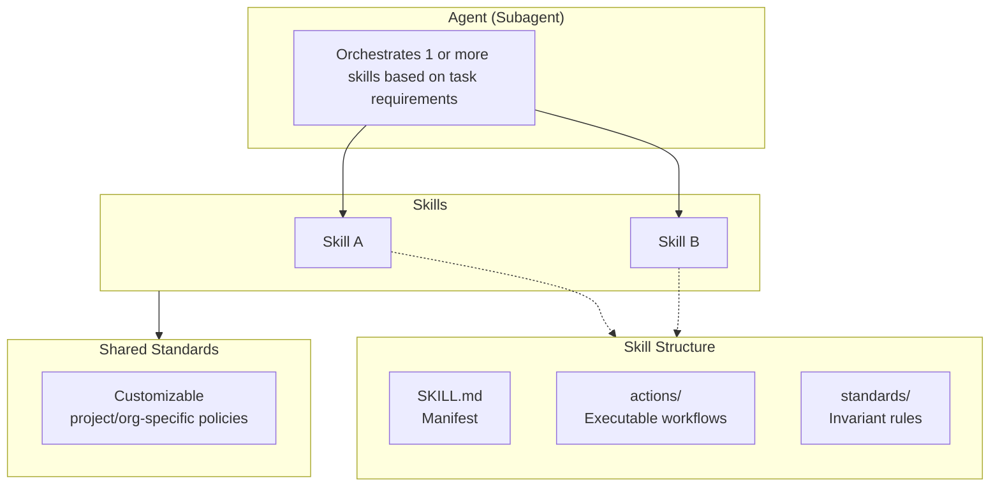

# AI Agent System

## Origins

This system is adapted from the agent system available at https://github.com/mcaps-microsoft/ise-anz-studio-hypervelocity-engineering 

## Architecture

The system uses a three-layer architecture where agents route to skills, which bundle actions and standards:

### Layer Responsibilities

| Layer | Location | Purpose |
|-------|----------|---------|
| **Agents** | `agents/*.md` | Thin routers that orchestrate 1+ skills based on task requirements |
| **Skills** | `skills/<domain>/` | Self-contained capability packages with actions and invariant standards |
| **Standards** | `standards/` | Customizable project/org-specific policies |

---

## Getting Started

### Using an Agent

When working with an AI assistant, reference the appropriate agent for your task:

| Task | Agent | Example Prompt |
|------|-------|----------------|
| Plan a feature | Feature-Planner | "Create a plan for implementing sample management scripts" |

---

## Quick Reference

### Available Agents

| Agent | Skill | Capabilities |
|-------|-------|--------------|
| Feature-Researcher | `skills/feature-research/` | research |

### Key Files

| File | Description |
|------|-------------|
| [`agent-system/AGENTS.md`](AGENTS.md) | Main routing table and skill references |
| [`agent-system/standards/standards.index.md`](standards/standards.index.md) | Index of all shared standards |

---

## Future plans

### Agents

- Something to update README and AGENTS files when updating SD card structure, firmware version, add scripts etc
- Something to update the agent system itself.  Review for project specifics, updates, stale information, new standards / skills / agents
- Agent(s) to do the research / plan / implement pattern
- Repo discovery / research agent. Use for exploring Firmware, for example. Human context vs agent context?
- Implement in a slower, step by step way
- Documentation creation, for reference and for learning
- Conversational tutor agent
